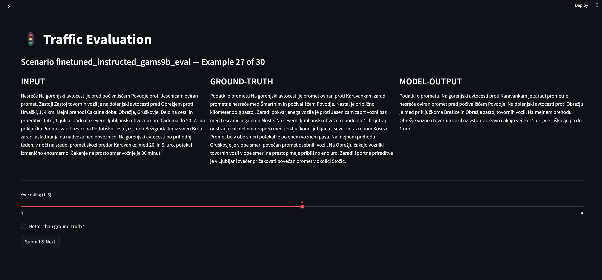
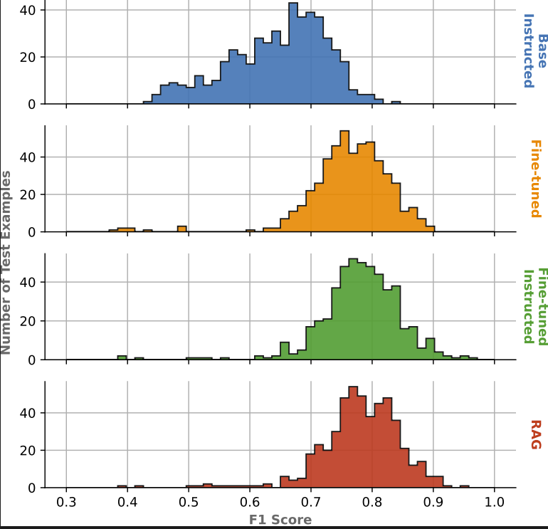

# Natural language processing course: `Automatic generation of Slovenian traffic news for RTV Slovenija`

---

## Team members  
- **Janez Tomšič**  
- **Žan Pušenjak**  
- **Matic Zadobovšek**  

---

## 📑 Table of contents
- [Natural language processing course: `Automatic generation of Slovenian traffic news for RTV Slovenija`](#natural-language-processing-course-automatic-generation-of-slovenian-traffic-news-for-rtv-slovenija)
  - [Team members](#team-members)
  - [📑 Table of contents](#-table-of-contents)
  - [📂 Project structure](#-project-structure)
    - [📁 `report/`](#-report)
    - [📄 `environment.yml`](#-environmentyml)
    - [📂 `src/utils/`](#-srcutils)
    - [📂 `src/notebooks/`](#-srcnotebooks)
    - [📂 `src/evaluation/`](#-srcevaluation)
      - [`app/`](#app)
      - [`progress/`](#progress)
      - [`results/`](#results)
    - [📂 `src/arnes_hpc/`](#-srcarnes_hpc)
  - [📊 Data](#-data)
  - [🔁 Reproducibility](#-reproducibility)
    - [🐍 Local setup with Conda](#-local-setup-with-conda)
    - [📓 Notebooks](#-notebooks)
    - [🌐 Streamlit app](#-streamlit-app)
    - [💻 ARNES HPC cluster setup](#-arnes-hpc-cluster-setup)
  - [🧪 Experiments](#-experiments)
    - [1️⃣ Base-instructed (prompting only)](#1️⃣-base-instructed-prompting-only)
    - [2️⃣ Fine-Tuned](#2️⃣-fine-tuned)
    - [3️⃣ Fine-Tuned + instructed](#3️⃣-fine-tuned--instructed)
    - [4️⃣ Fine-tuned + instructed + RAG](#4️⃣-fine-tuned--instructed--rag)
    - [✅ Evaluation](#-evaluation)
      - [📈 Automatic evaluation](#-automatic-evaluation)
      - [👥 Manual evaluation](#-manual-evaluation)
  - [📊 Results](#-results)
    - [🔬 Automatic evaluation (SloBERTa cosine similarity)](#-automatic-evaluation-sloberta-cosine-similarity)
    - [👥 Manual evaluation](#-manual-evaluation-1)
    - [📈 F1 score distribution](#-f1-score-distribution)
---


## 📂 Project structure

Below is an overview of the repository layout.

```
.
├── report/
├── environment.yml
├── src/
│   ├── utils/
│   ├── notebooks/
│   │   ├── dataset_preparation.ipynb
│   │   ├── exploration.ipynb
│   │   ├── evaluation.ipynb
│   │   ├── finetuning_example.ipynb
│   │   └── prompting.ipynb
│   ├── evaluation/
│   │   ├── app/
│   │   │   └── app_evaluation.py
│   │   ├── progress/
│   │   └── results/
│   └── arnes_hpc/
│       ├── archive/
│       ├── containers/
│       ├── models/
│       │   └── final_model_9b/
│       └── scripts/
│           ├── finetuning.py
│           ├── instructions.txt
│           ├── run_base_model.py
│           ├── run_finetuned_model.py
│           ├── run_instructed_finetuned_model.py
│           ├── run_rag_model.py
│           ├── run_slurm_finetuning.sh
│           ├── run_slurm_base_eval.sh
│           ├── run_slurm_finetuned_eval.sh
│           ├── run_slurm_instructed_eval.sh
│           └── run_slurm_rag_eval.sh
│           └── rag/
│               ├── data_creation/
│               ├── embed.py
│               ├── rag_instructions_embeddings.npy
│               ├── rag_instructions.jsonl
│               ├── rag_roads_embeddings.npy
│               ├── rag_roads.jsonl
│               └── retrieve_example.py
└── README.md
```

---

### 📁 `report/`  
PDFs of our project write-ups and submission reports.

---

### 📄 `environment.yml`  
Conda environment for local reproducibility (`conda env create -f environment.yml`).

---

### 📂 `src/utils/`  
Helper functions for parsing, cleaning and structuring raw traffic data.

---

### 📂 `src/notebooks/`  
Interactive Jupyter notebooks for:  
- **dataset_preparation.ipynb** — building and cleaning our dataset 
- **exploration.ipynb** — data inspection and exploratory data analysis  
- **evaluation.ipynb** — automatic metrics (SloBERTa score) 
- **finetuning_example.ipynb** — a toy LoRA run to run on Colab  
- **prompting.ipynb** — structured-prompt experiments  

---

### 📂 `src/evaluation/`  
#### `app/`  
A Streamlit app (`app_evaluation.py`) we built to perform manual rating on test outputs.  
#### `progress/`  
Each member’s intermediate ratings.  
#### `results/`  
Final aggregated outputs for all **4 scenarios** (base-instructed, fine-tuned, fine-tuned + instructed, fine-tuned + instructed + RAG) on 500 examples.

---

### 📂 `src/arnes_hpc/`  
Everything needed to run our **full experiments on the ARNES HPC cluster**:

- **archive/**: old / discarded models & scripts  
- **containers/**: Singularity definition files for building `.sif` images  
- **models/final_model_9b/**: the GaMS-9B checkpoint & LoRA adapter  
- **scripts/**:  
  - **finetuning.py**: QLoRA fine-tuning on H100  
  - **instructions.txt**: base-prompt rules  
  - **run_*.py** & **run_slurm_*.sh**: launch scripts for each of the 4 experiments  
  - **rag/**: embed & index road-chunks & instruction docs with LaBSE + retrieval demo

---

## 📊 Data

The dataset used in this project is **not included in this GitHub repository** due to size. However, you can download it from the following link:

🔗 [Shared dataset folder (OneDrive)](https://unilj-my.sharepoint.com/:f:/g/personal/mz1034_student_uni-lj_si/Ev3111JpDF5GnWOgAbfmoj4B8Co1IlAyHUzjfHKZhusvjA?e=HB6Tvy)


The shared folder contains the original traffic report data, and also our processed training data.

We created a clean, structured JSONL file called `train_promet.jsonl`, which is used for fine-tuning the language model. Each entry is a JSON object with two keys:  
- `"prompt"` — a system-like input containing raw structured text  
- `"response"` — the corresponding expected radio-ready traffic report

---

## 🔁 Reproducibility

Follow these instructions depending on the setup (local or HPC):

---

### 🐍 Local setup with Conda

You can start by creating the required environment using Conda. The provided `environment.yml` file will install all necessary dependencies under the environment name `nlp-project`. Later on we also provide separate instructions, for those who would prefer to manually install the needed dependencies.

```bash
conda env create -f environment.yml
conda activate nlp-project
```

---

### 📓 Notebooks

All notebooks under `notebooks/` are designed for local execution — with the exception of `finetuning_example.ipynb`, which is a simplified demo version of LoRA fine-tuning, and is prepared for execution on Colab.

To run notebooks locally, make sure the following Python packages are installed (already included via `environment.yml`, but if you would prefer to do manual installation):

```bash
pip install beautifulsoup4 matplotlib numpy pandas seaborn striprtf ipython transformers torch scikit-learn
```

---

### 🌐 Streamlit app

To run the manual evaluation Streamlit app in `src/evaluation/app/app_evaluation.py`, you'll need:

```bash
pip install pandas streamlit
```

You can then launch the application using:
```bash
cd src/evaluation/app
streamlit run app_evaluation.py
```

---

### 💻 ARNES HPC cluster setup

To run the full training or evaluation jobs on the ARNES HPC cluster:

1. Navigate to our project folder:
```bash
cd /d/hpc/projects/onj_fri/trije_konjeniki_apokalipse/
```

2. Launch jobs using:
```bash
sbatch run_slurm_<type>_eval.sh
```

The structure is modular — for each `.sh` (Slurm script) there's a corresponding Python script that performs the actual execution:

| SLURM script                   | Python script                      |
|-------------------------------|------------------------------------|
| `run_slurm_base_eval.sh`      | `run_base_model.py`               |
| `run_slurm_finetuned_eval.sh` | `run_finetuned_model.py`          |
| `run_slurm_instructed_eval.sh`| `run_instructed_finetuned_model.py`|
| `run_slurm_rag_eval.sh`       | `run_rag_model.py`                |

Each of these jobs produces a `.txt` file containing model outputs for 500 examples. These results are stored and used later for manual and automatic evaluation.

All the files required for running are already available under the same directory on HPC, so the workflow is fully reproducible and requires no extra setup.

---

## 🧪 Experiments

We explored four experimental settings to see the effectiveness of prompt engineering, fine-tuning, and retrieval-augmented generation (RAG).

---

### 1️⃣ Base-instructed (prompting only)

We used the original `cjvt/GaMS-9B-Instruct` model with structured prompting. The input format was designed with our defined rules, and no parameter updates were performed.

---

### 2️⃣ Fine-Tuned

We performed **QLoRA** fine-tuning of the `cjvt/GaMS-9B-Instruct` model using our processed `train_promet.jsonl` dataset. The dataset was split 80/20 for training and validation.

We used:

- **Quantisation**: 4-bit NF4 with bfloat16 compute  
- **LoRA config**: `r=8`, `alpha=32`, `dropout=0.05`, targeting attention modules  
- **Batching**: `batch_size=1` with `gradient_accumulation=8`  
- **Max length**: 512 tokens  
- **Epochs**: 3  
- **Scheduler**: cosine with warmup  
- **Precision**: bfloat16  
- **Optimizer**: AdamW

The adapter and tokenizer were saved to disk for later inference.

---

### 3️⃣ Fine-Tuned + instructed

We used the fine-tuned model, but kept the structured prompts to guide generation, essentially combining both approaches.

---

### 4️⃣ Fine-tuned + instructed + RAG

We enhanced the instructed setup with **retrieval-augmented generation** using dense LaBSE embeddings. We embedded and indexed road and instruction snippets, retrieved the most relevant ones based on cosine similarity to input, and added them to the prompt.

---

### ✅ Evaluation

#### 📈 Automatic evaluation

We used **SloBERTa** and **cosine similarity** to score the model outputs against ground-truth references across all 4 settings on 500 test samples.

#### 👥 Manual evaluation

To get a better sense of model quality, we designed a **Streamlit-based web app** (`app_evaluation.py`) to allow all three of us to independently rank outputs of all 4 scenarios per example.

We followed this process:

1. **Pre-evaluation calibration** — we manually rated 50 **calibration examples** and compared our ranking differences to improve rating agreement. This helped us normalize our evaluation criteria and better understand nuances in generated outputs.

2. **Final evaluation** — we then independently rated **30 examples each**, across all four model variants.

For each example and scenario, we:

- Gave **a rating from 1 to 5**, assessing the overall usefulness and clarity.

- Compared each output directly to the ground-truth report, noting whether the generated output was better or worse.

The final scores are computed as a **global average** across all three of us for both criteria.

🖼️ The Streamlit app used for manual evaluation:



Results from both evaluations are summarized in the next section.

---

## 📊 Results

We evaluated all four experimental setups using **two types of evaluation**:

- **Automatic evaluation** using **SloBERTa + cosine similarity** on 500 test examples.
- **Manual evaluation** of 30 test examples.

---

### 🔬 Automatic evaluation (SloBERTa cosine similarity)

| Model                          | Precision       | Recall          | F1-score        | Length difference (in words) |
|-------------------------------|-----------------|------------------|------------------|------------------------------|
| Base instructed                | 0.608 ± 0.004   | 0.683 ± 0.004    | 0.643 ± 0.004    | 1.904 ± 0.042                |
| Fine-tuned                    | 0.774 ± 0.003   | 0.753 ± 0.004    | 0.762 ± 0.003    | 0.818 ± 0.022                |
| Fine-tuned and instructed     | **0.817 ± 0.003** | **0.752 ± 0.004** | **0.781 ± 0.003** | **0.732 ± 0.017**            |
| Fine-tuned and instructed + RAG | 0.815 ± 0.003   | 0.752 ± 0.004    | 0.779 ± 0.003    | 0.752 ± 0.018                |

---

### 👥 Manual evaluation

| Scenario                      | Avg. Rating | % Outputs better than ground truth |
|------------------------------|-------------|------------------------------------|
| Base instructed              | 2.00        | 6.7%                               |
| Fine-tuned                  | 3.17        | 40.0%                              |
| Fine-tuned + instructed     | **3.37**    | **43.3%**                          |
| Fine-tuned + instructed + RAG | 3.30        | 40.0%                              |

---

### 📈 F1 score distribution

The histogram below shows the distribution of **F1 scores** across the 500 test examples, highlighting performance spread per method.



---

[⬆️ back to top](#-table-of-contents)